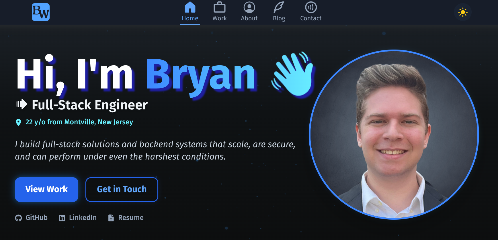
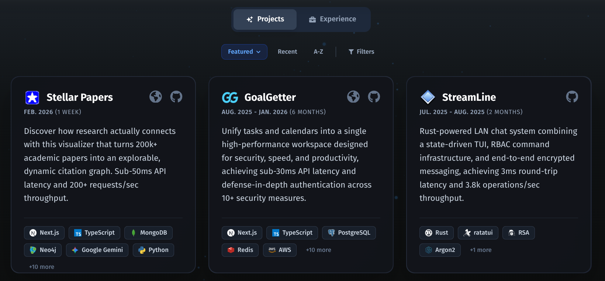
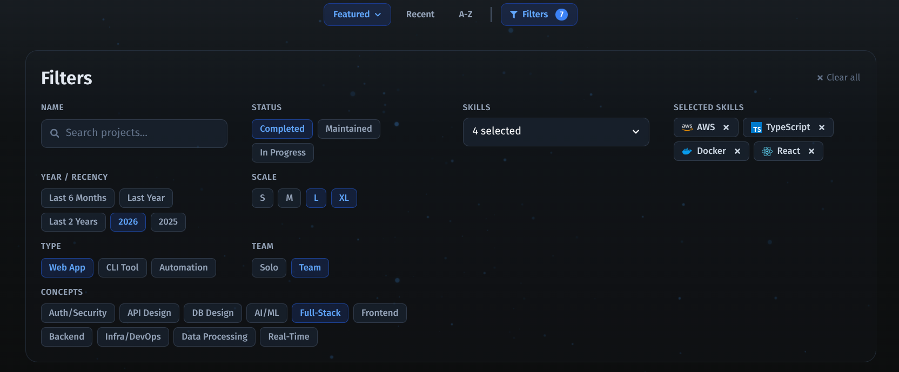
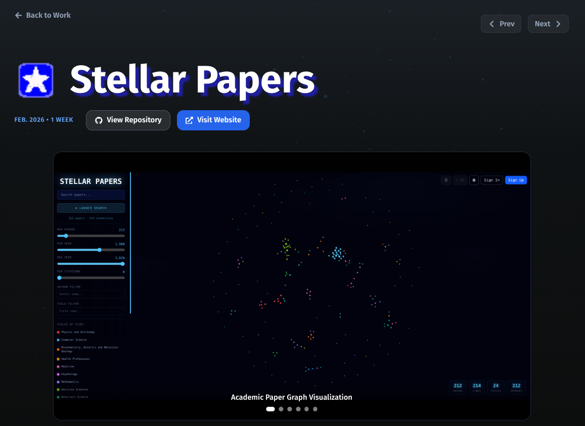
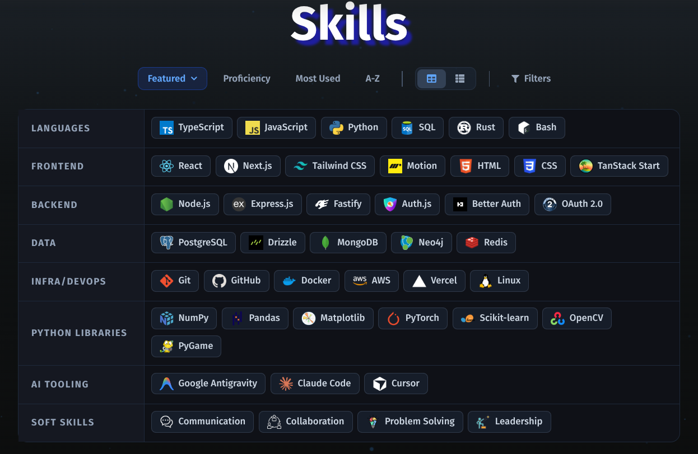

<div align="center">

# Portfolio Website

_A visual showcase of my work as an engineer._

[](#)
[](#)
[](#)
[](#)
[](#)

</div>

## Overview

This portfolio website provides a comprehensive look at my projects, experience, skills, and thoughts captured through blog posts. It uses polished visuals and animations, and a lightweight backend to add additional features to enhance the viewing experience.

## Key Features

- **Everything in One Place:** An easily explorable UI allowing easy exploration of detailed work pages, advanced sorting and filtering, and blog posts. Both light and dark themes are supported.
- **Polished Environment:** Interact with practically every UI element and enjoy a wealth of micro-animations that make the app feel truly alive.
- **Optimized Performance:** Smooth rendering capabilities powered by natively optimized visuals and optimized build strategies.
- **Rock-Solid Security:** Protected API endpoints to ensure safety and stability.

## Tech Stack

| Category              | Technologies                                  |
| --------------------- | --------------------------------------------- |
| **Frontend**          | React, TypeScript, Vite, Tailwind CSS, Motion |
| **Backend/API**       | Node.js, Express.js, TypeScript               |
| **Data**              | PostgreSQL, SQL                               |
| **External Services** | Neon, Formspree                               |
| **Deployment**        | Vercel, Railway                               |

## Images

#### The Landing Page:



#### View Projects:



#### Advanced Filters:



#### Detailed Project Pages:



#### Skills Overview:



#### Surprise Interactions:


## Local Installation & Setup

Although this app is available publicly, you are free to run it locally as well, given you have the correct dependencies and environment variables.

1. Clone the repository with `git clone https://github.com/BryanWieschenberg/Portfolio.git`, enter the directory with `cd portfolio`, then install dependencies with `npm install`
2. Open a terminal and navigate to the server directory: `cd server`, then install dependencies with `npm install`
3. Set up your local `.env` file with the following keys using your own credentials:

```bash
# Server Configuration
CORS_ORIGIN=http://localhost:5173

# Database (Neon PostgreSQL)
DATABASE_URL=postgres://<user>:<password>@<neon-hostname>/<database_name>?sslmode=verify-full

# External APIs
GITHUB_TOKEN=<your_github_personal_access_token>
COOKIE_SECRET=<random_secure_string>
```

4. Navigate to the frontend directory: `cd ../client`, then install dependencies with `npm install`
5. Setup your local `.env` file with the following key:

```bash
# Server Configuration
VITE_API_URL=http://localhost:3001
```

6. Navigate back to the root directory: `cd ..`, then run the frontend and backend development servers concurrently with `npm run dev`, visit `http://localhost:5173`, and you're ready to go!
